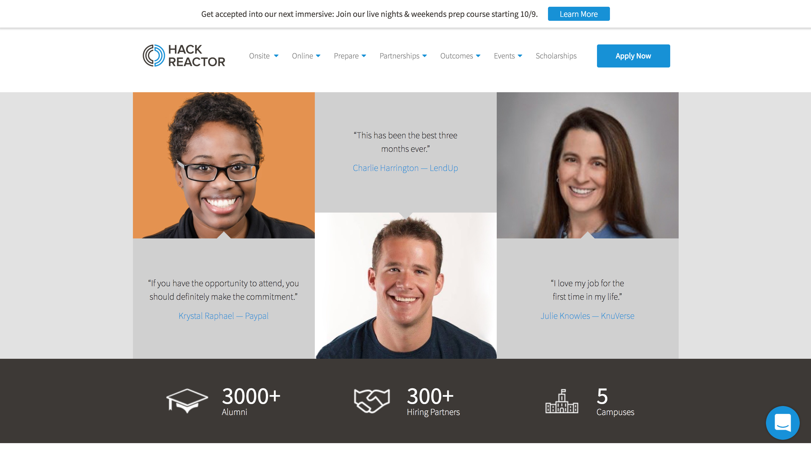

OVERVIEW

<a href="https://sassgallerybydave.surge.sh/">SASS Gallery</a> is a personal project I completed as a way of teaching myself how to use the SASS preprocessor in general, and how to use it with React specifically. In doing this, I used SASS to clone the home page designs of three well-designed and aesthetically challenging websites, hackreactor.com, data.mx.com, and uber.com.

As a result of this project, I developed a sound understanding of, and a strong ability to use SASS features including nesting, variables, mixins, imports, @extend, color functions, and partials.

MAJOR TECHNOLOGIES

  <ul>
    <li>React</li>
    <li>JavaScript (ES6)</li>
    <li>SASS</li>
  </ul>

HACK REACTOR

MX

Uber

